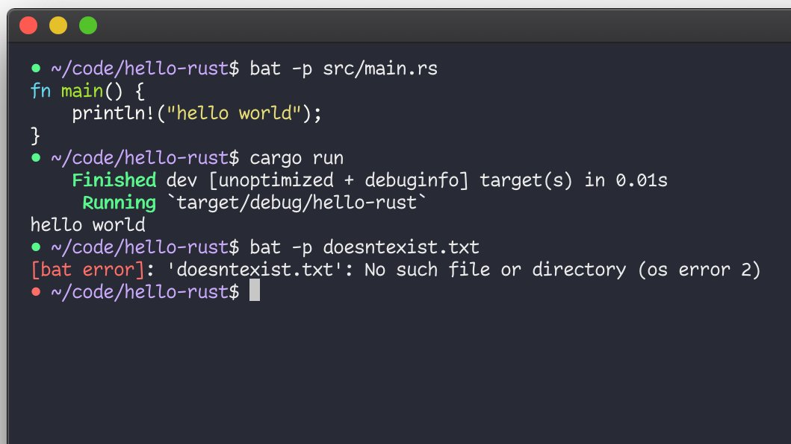

# Prompts I've been inspired by

## Luna / @lunasorcery

<https://twitter.com/lunasorcery/status/1433555187604463620>:

> Since it gets asked almost every time I post a screen recording or screenshot of it, here's a mini-thread detailing my terminal configuration.
>
> (which looks something like this)
>
> 

Luna's prompt includes green/red dots to show whether the previous command was successful.

I like the idea of highlighting errors on previous commands; I haven't found a way to add it to my prompt that I like.
The always-on green/red dots are too distracting, because 99% of my prompts would be green and then it becomes visual noise.
I considered adding something to the context line or prompt character to indicate a failure, but it wasn't obvious enough that the error was for the *previous* prompt, not something inherent to this one.
